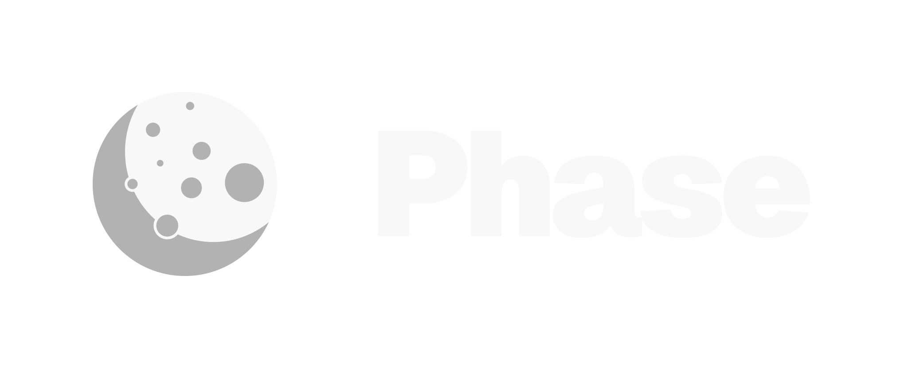

	

# Documentation

Visit [https://phasebot.xyz/docs](https://phasebot.xyz/docs) to view the full documentation.

## Community

The Phase Bot community can be found in our [Discord server](https://phasebot.xyz/redirect/discord), where you can ask questions, voice ideas, and share your projects.

Our [Code of Conduct](https://github.com/notcharliee/phase/blob/main/.github/CODE_OF_CONDUCT.md) applies to all Phase Bot community channels.

## Contributions

To contribute you can create pull requests or open issues. There are issue templates available for creating feature requests and reporting bugs, please use them.

## Security

If you believe you have found a security vulnerability in our code, we encourage you to responsibly disclose this and not open a public issue. We will investigate all legitimate reports. Contact the developers in a support ticket to disclose any security vulnerabilities.
